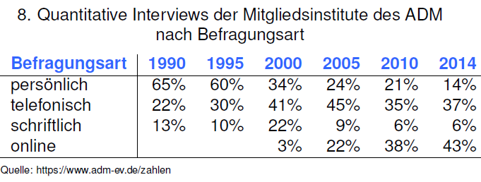
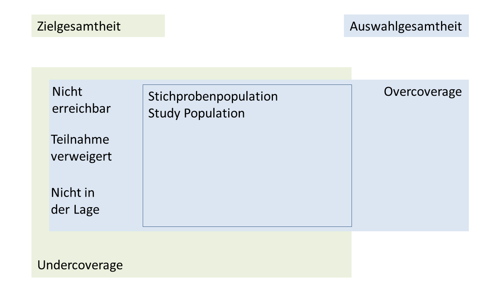
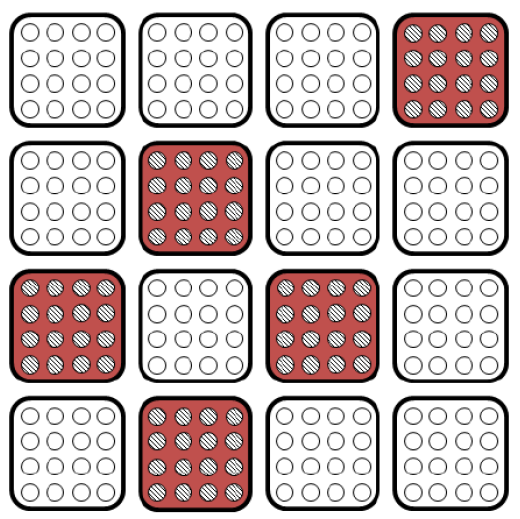

```{r setup, include=FALSE}
knitr::opts_chunk$set(echo = F,message=F,cache=T)
library(knitr)
SP_teil <- F
```


## Einordnung - Verschiedene Arten von Gewichten

Designgewicht

- um die Stichprobenziehung mit ungleichen Wahrscheinlichkeiten zu kompensieren (z.B. stratifizierte
Stichproben mit einer disproportionalen Allokation)

Anpassungsgewichte

- um schlechte Stichproben anzupassen 
- um Nonresponse zu Kompensieren 

Gesamtgewicht

Gesamtgewicht = Design-Gewicht * Anpassungsgewicht

```{r,echo=F}
library(survey)
```

## Eigenschaften von Gewichten

- Ein Survey-Gewicht ist ein Wert, der jeweils einer Beobachtung zugeordnet ist.

- Oft werden Gewichte auf die Anzahl der Fälle oder die Populationsgröße normiert.

- Ein Gewicht w kann kleiner , gleich oder größer als 1 sein.

- Ein Design-Gewicht ist bei der Schätzung proportional zum relativen Beitrag eines Befragten.

- Es ist proportional zum Inversen der Inklusionswahrscheinlichkeit.

- Die Größe einer speziellen Gruppe wird durch die Summe ihrer Gewichte geschätzt. 

# Grundlagen der Designgewichtung


## Was sind Design-Gewichte

- Stichprobenziehung - also keine Vollerhebung
- ungleiche Wahrscheinlichkeiten - bspw. durch Schichtung und Klumpung

## Allgemeine Überlegungen zum Erhebungsdesign

- Ziel der Erhebung
- Genaue Definition der Grundgesamtheit
- Mögliche Auswahlrahmen
- Erhebungsmodus
- Externe Daten
- Aussagen über Subgruppen
- Modellvorstellungen
- Nonresponse
- Stichprobendesign
- Schätzverfahren, Gewichtung
- Stichprobenkosten
- Software
- Dokumentation, Methodenbericht

## Erhebungsmodus

- persönlich-mündlich
- telefonisch
- schriftlich
- online
- social media
- mixed mode

## Überblick Zahlen Erhebungsmodus



## Beispiele von Bevölkerungsumfragen

- BIBB/BAuA-Erwerbstätigenbefragung - Arbeit und Beruf im Wandel, Erwerb und Verwertung beruflicher Qualifikationen

<http://www.bibb.de/de/62622.htm>

- Mikrozensus (1 Prozent Stichprobe)

<https://www.destatis.de/DE/ZahlenFakten/GesellschaftStaat/Bevoelkerung/Mikrozensus.html>

<https://www.destatis.de/DE/Publikationen/Qualitaetsberichte/Bevoelkerung/Mikrozensus2013.html>

- European Social Survey

<http://ess.nsd.uib.no>

<http://www.europeansocialsurvey.org>

- PIAAC

<http://www.gesis.org/piaac/piaac-home/>


## Vorteile von Stichproben

- Stichproben in der Regel billiger
- Geringere Belastung für die Bevölkerung
- Ergebnisse stehen bei Auswahlen schneller zur Verfügung
- Geringere Größe des Mitarbeiterstabes notwendig,
bessere Schulung möglich
- Größere Messgenauigkeit bei Auswahlen (Fachleute)
- Besserer Umgang mit Ausfällen möglich
(Nachfassaktionen, evtl- auch mit Incentives)
- Einzige Möglichkeit bei Zerstörung des Untersuchungsgegenstandes
(z-B- Gütekontrolle bei Glühlampen, Elchtest, Blutgruppe)


## Einschränkungen bei Stichproben

- Stichproben bei verhältnismäßig kleinen Grundgesamtheiten nicht sinnvoll
- Aussagen für kleine Subgruppen unpräziser als bei Totalerhebung
- Bei sehr heterogenen Grundgesamtheiten eher Totalerhebung
(z-B- Fingerabdrücke in einer Population im Gegensatz zu Blutzellen in einem Körper)
- Totalerhebungen sind einzige Möglichkeit bei Gefahr der Zerstörung der
Grundgesamtheit (z-B-Rückrufaktion)

## Grundgesamtheit

- Die Grundgesamtheit (engl- target population) ist die Menge von Elementen, für
die Aussagen - z-B- unter Zuhilfenahme von Statistiken aus einer Stichprobe -
gemacht werden sollen- Sie wird auch Population, Untersuchungs- oder
Zielgesamtheit bezeichnet-
- Sie muss sachlich, räumlich und zeitlich definiert sein-
- Sie muss an der Themenstellung und an der praktischen Durchführbarkeit
orientiert sein

## Auswahlrahmen/Auswahlgesamtheit

- Der Auswahlrahmen (engl. sampling frame) ist eine Liste von Einheiten (engl.
sampling units), aus dem die Stichprobe gezogen wird und über den man Zugang zu den Untersuchungseinheiten erhält (z.B. das Telefonbuch). - Die über den Auswahlrahmen erreichbaren Einheiten bilden die Auswahlgesamtheit.

- Idealerweise enthält der Auswahlrahmen genau alle Einheiten der Untersuchungsgesamtheit. In der Praxis ist das aber selten der Fall.

## Coverage

- Ist ein Element der Grundgesamtheit im Auswahlrahmen bzw. der Auswahlgesamtheit nicht enthalten, gehört es zum „undercoverage“ , d.h. zu einem Fehlbestand. Ein Beispiel wären die Personen, die nicht im Telefonfonbuch stehen.

- Gehört ein Element des Auswahlrahmens nicht zur Grundgesamtheit, spricht
man von „overcoverage“, d.h. von Karteileichen oder Überhöhung. Ein Beispiel
wären Geschäftsnummern im Telefonbuch.

## Die Auswahlgesamtheit




# Stichprobendesign


## Beispiel einfache Zufallsstichprobe

```{r}
yi = c(1,2,4,4,7,7,7,8)
yi2 = c(1,2,4,4,7,7,7,8)
id = 1:length(yi)
dat <- data.frame(yi,id)
# kable(dat)
# names(yi) <- id
# barplot(yi,col="royalblue")
cat("Population:",yi)
n <- 4
for(i in 1:8){
  samp1 <- sample(yi,n,replace=T)
  cat(i,". Stichprobe (n=4):",samp1,"\n",sep="")
}
```

## Was passiert bei vielen Stichproben

```{r}
Nsamples <- 10
SRS_bsp <- function(Nsamples){
  erg <- list()
  for (i in 1:Nsamples){
    erg[[i]] <- sample(yi,n)  
  }
  E_mean <- unlist(lapply(erg,mean))
  return(E_mean)
}
```


```{r}
par(mfrow=c(2,2))
hist(SRS_bsp(10),col=2,main="")
hist(SRS_bsp(100),col=2,main="")
hist(SRS_bsp(1000),col=2,main="")
hist(SRS_bsp(10000),col=4,main="sampling distribution")
```


```{r,eval=F}
library(xtable)
# install.packages("tables")
library(tables)
# https://cran.r-project.org/web/packages/htmlTable/vignettes/tables.html
```


## Systematische Stichprobe

```{r,eval=SP_teil,echo=F}
# install.packages("sampling")
library(sampling)
N=12
n=3
cluster(1:N,method="systematic",size=n,pik=rep(1,N)/N)
# Mainz Gabler - Folie 16
```


## Cluster Sample




## Schichtung


## Beispieldatensatz Schichtung

```{r}
data=rbind(matrix(rep("nc",165),165,1,byrow=TRUE),matrix(rep("sc",70),70,1,byrow=TRUE))
data=cbind.data.frame(data,c(rep(1,100), rep(2,50), rep(3,15), rep(1,30),rep(2,40)),
1000*runif(235))
names(data)=c("state","region","income")
kable(head(data))
```


```{r}
region_l <- paste("region",data$region)
state_l <- paste("state",data$state)
kable(table(region_l,state_l))
```


```{r}
# there are 5 cells with non-zero values
# one draws 5 samples (1 sample in each stratum)
# the sample stratum sizes are 10,5,10,4,6, respectively
# the method is 'srswor' (equal probability, without replacement)

s=sampling::strata(data,c("region","state"),
         size=c(10,5,10,4,6), 
         method="srswor")
```


## Stratified Random Sampling (STRAT)

```{r,echo=F,eval=F}
library(survey)
library(sampling)
test_frame <- cbind((1:14),c(rep(1:4),2*rep(1,3),3*rep(1,3),4*rep(1:4)))

names(test_frame) <- c("NR","stratum")
sampling::strata(test_frame,stratanames="stratum",
       size=rep(2,4),method="srswor")
```


## Stratified sampling with disproportional allocation


Horvitz-Thompson estimator is identical to the usual stratified estimator

## [Beispiel Lohr](http://www.stat.purdue.edu/~jennings/stat522/datasets/index.html)

```{r,echo=F}
# install.packages("SDaA")
library(SDaA)
data(agstrat)
# colnames(agstrat)
cnames <- c("state","acres92","acres87","region","weight")
# intersect(colnames(agstrat),cnames)
ind <- match(cnames,colnames(agstrat))
kable(head(agstrat[,ind]))
```

Beispiel Lohr agstrat.dat
Strata: North Central, Northeast, South, West

## 

```{r,echo=F}
reg <- agstrat$region
tab_reg <- table(agstrat$region)
reg_names <- c("North Central","Notheast,South,West")
```


## [Beispiele von Lohr](https://r-forge.r-project.org/scm/viewvc.php/*checkout*/pkg/inst/doc/SDaA_using_survey.Rnw?revision=24&root=sda&pathrev=24)

```{r,echo=F}
  ### Example 3.2, p. 63 
agsrsDesign <- svydesign(ids=~1, weights = ~1, data = agsrs)
erg1 <- svyratio(numerator = ~acres92, denominator = ~acres87,  design = agsrsDesign) # proportion B hat

kable(erg1$ratio)

kable(erg1$var)
```

```{r BeispielGabler,echo=F,eval=F}
library(survey)
datstr <- read.table("agstrat.dat", header = TRUE, sep = ",", na.strings = "-99")
fpc_p <- function(x,y,data){for(i in 1:length(x)){data[data%in%x[i]] <- y[i]}
return(data)} # population sizes
fpc <- as.numeric(fpc_p(c("NC","NE","S","W"),c(1054,220,1382,422),data=as.character(datstr$REGION)))
datstr <- cbind(datstr,fpc)
strat_design <- svydesign(id=~1,strata=~REGION,fpc=~fpc,data=datstr)
strat_design
Stratified Independent Sampling design
svydesign(id = ~1, strata = ~REGION, fpc = ~fpc, data = datstr)
```

## Horvitz Thompson

The Horvitz-Thompson estimator for the total T_y is defined by


It is unbiased if all inclusion probabilities are positive.
The variance of the Horvitz-Thompson estimator is given by:


If all inclusion probabilities of second order pi_ij are positive we have:


# Grundlagen der Anpassungsgewichtung

## Cell Weights


The iterative proportional fitting algorithm (IPF) is an iterative algorithm for estimating cell values of a contingency table such that the marginal totals remain
fixed and the estimated table decomposes into an outer product. 

Deming and Stephan(1940)

## Nonresponse


## Nonresponse

- Sometimes, answers for some units of the selected sample
are either totally or partly missing. 
- This is referred to as nonresponse.

- Sources for unit non-response can be not-athomes,
refusals, unable to answer or not found. 
- If a respondent answers some but not all the items, these missing are referred to as item non-response. 

- Non-response is a very serious problem and the treatment of which requires modeling assumptions. 

- Therefore, it may be easier to deal
with non-response in the framework of model-based
inference. 

- Usually, weighting procedures are applied for
treating unit non-response and imputation methods for item
non-response. Calibration estimators are used very often
nowadays to get a grip on the non-response problem.

## Calibration Estimator (GREG)