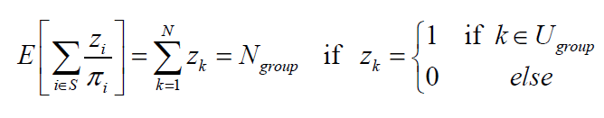
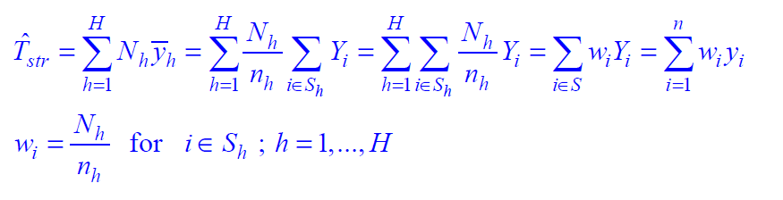
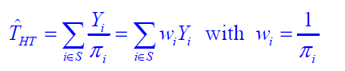
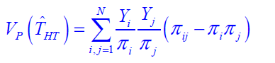
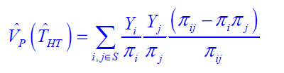
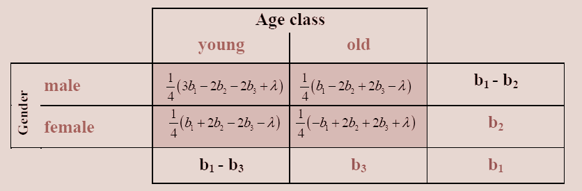
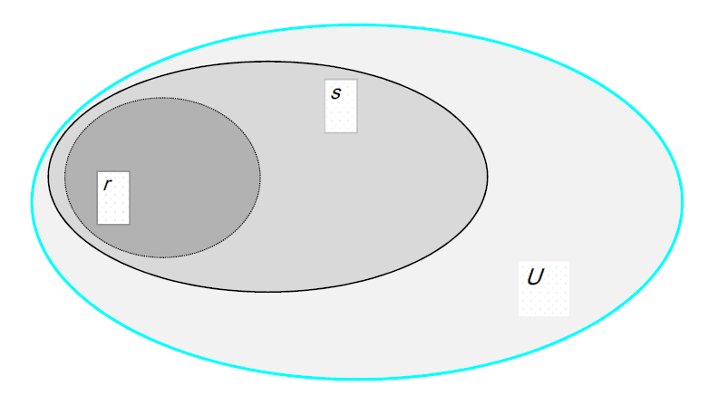

```{r setup, include=FALSE}
knitr::opts_chunk$set(echo = TRUE,message=F)
library(knitr)
```

## Einleitung

- Ein Survey Gewicht ist ein Wert, der jeweils einer Beobachtung zugeordnet ist.

- Oft werden Gewichte auf die Anzahl der Fälle oder die Populationsgröße normiert.

- Ein Gewicht w kann kleiner , gleich oder größer als 1 sein.

- Ein Design-Gewicht ist bei der Schätzung proportional zum relativen Beitrag eines Befragten.

- Es ist proportional zum Inversen der Inklusionswahrscheinlichkeit.

- Die Größe einer speziellen Gruppe wird durch die Summe ihrer Gewichte geschätzt. 



## Verschiedene Arten von Gewichten

Design Gewichte

- um die Stichprobenziehung mit ungleichen Wahrscheinlichkeiten zu kompensieren (z.B. stratifizierte
Stichproben mit einer disproportionalen Allokation)

Anpassungsgewichte

- um schlechte Stichproben anzupassen 
- um Nonresponse zu Kompensieren 

Gesamtgewicht

Gesamtgewicht = Design-Gewicht * Anpassungsgewicht

```{r,echo=F}
library(survey)
```

## Schichtung

## Stratified sampling with disproportional allocation



Horvitz-Thompson estimator is identical to the usual stratified estimator

## [Beispiel Lohr](http://www.stat.purdue.edu/~jennings/stat522/datasets/index.html)

```{r,echo=F}
# install.packages("SDaA")
library(SDaA)
data(agstrat)
# colnames(agstrat)
cnames <- c("state","acres92","acres87","region","weight")
# intersect(colnames(agstrat),cnames)
ind <- match(cnames,colnames(agstrat))
kable(head(agstrat[,ind]))
```

Example Lohr agstrat.dat
Strata: North Central, Northeast, South, West

## 

```{r,echo=F}
reg <- agstrat$region
tab_reg <- table(agstrat$region)
reg_names <- c("North Central","Notheast,South,West")
```


## [Alle Beispiele von Lohr](https://r-forge.r-project.org/scm/viewvc.php/*checkout*/pkg/inst/doc/SDaA_using_survey.Rnw?revision=24&root=sda&pathrev=24)

```{r,echo=F}
  ### Example 3.2, p. 63 
agsrsDesign <- svydesign(ids=~1, weights = ~1, data = agsrs)
erg1 <- svyratio(numerator = ~acres92, denominator = ~acres87,  design = agsrsDesign) # proportion B hat

kable(erg1$ratio)

kable(erg1$var)
```

```{r BeispielGabler,echo=F,eval=F}
library(survey)
datstr <- read.table("agstrat.dat", header = TRUE, sep = ",", na.strings = "-99")
fpc_p <- function(x,y,data){for(i in 1:length(x)){data[data%in%x[i]] <- y[i]}
return(data)} # population sizes
fpc <- as.numeric(fpc_p(c("NC","NE","S","W"),c(1054,220,1382,422),data=as.character(datstr$REGION)))
datstr <- cbind(datstr,fpc)
strat_design <- svydesign(id=~1,strata=~REGION,fpc=~fpc,data=datstr)
strat_design
Stratified Independent Sampling design
svydesign(id = ~1, strata = ~REGION, fpc = ~fpc, data = datstr)
```

## Horvitz Thompson

The Horvitz-Thompson estimator for the total T_y is defined by



It is unbiased if all inclusion probabilities are positive.
The variance of the Horvitz-Thompson estimator is given by:



If all inclusion probabilities of second order pi_ij are positive we have:



## Cell Weights



The iterative proportional fitting algorithm (IPF) is an iterative algorithm for estimating cell values of a contingency table such that the marginal totals remain
fixed and the estimated table decomposes into an outer product. 

Deming and Stephan(1940)

## Nonresponse



## Nonresponse

Sometimes, answers for some units of the selected sample
are either totally or partly missing. This is referred to as nonresponse.
Sources for unit non-response can be not-athomes,
refusals, unable to answer or not found. If a
respondent answers some but not all the items, these missing
are referred to as item non-response. Non-response is a very
serious problem and the treatment of which requires
modeling assumptions. Therefore, it may be easier to deal
with non-response in the framework of model-based
inference. Usually, weighting procedures are applied for
treating unit non-response and imputation methods for item
non-response. Calibration estimators are used very often
nowadays to get a grip on the non-response problem.

## Calibration Estimator (GREG)